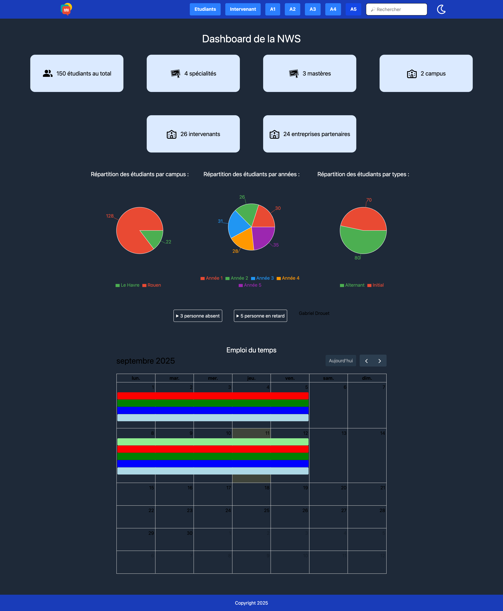
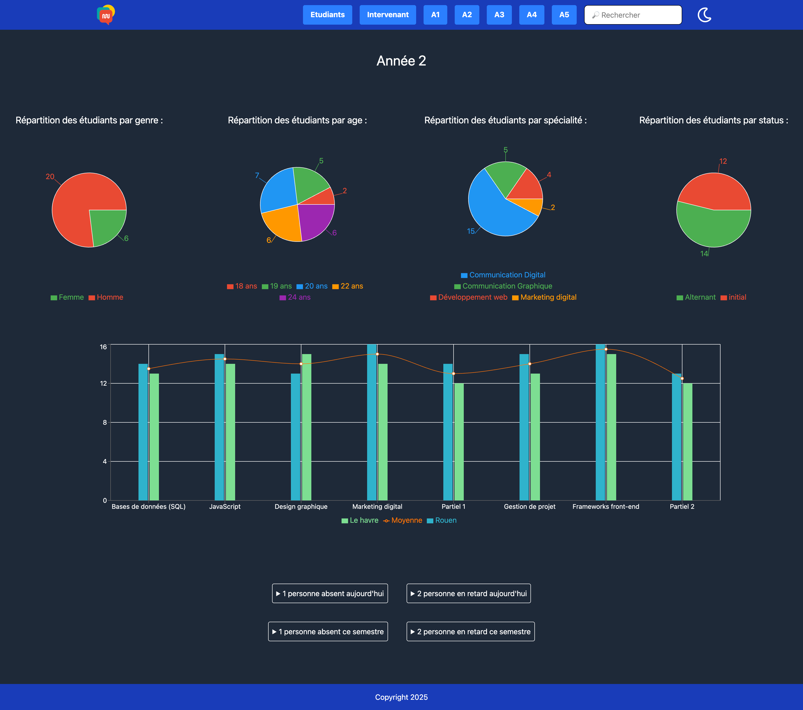
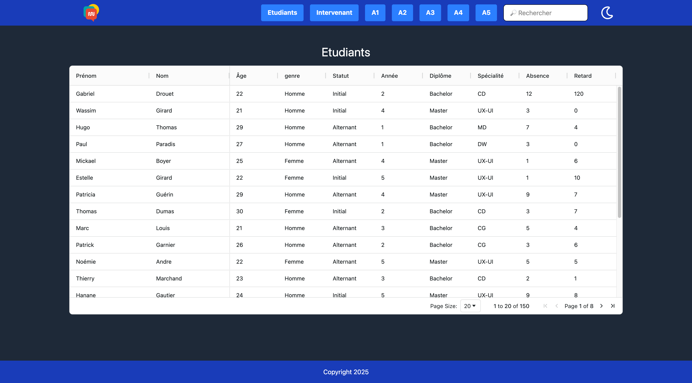

# Dashboard de la NWS

Ce projet est la création d'un dashboard pour la Normandie Web School. Il est réalisé avec React.js et Tailwind CSS.  
Le dashboard n'est pas dynamique : les données sont directement intégrées dans le fichier data.json

Le projet est conteneurisé avec Docker et est déployé sur un VPS via un reverse proxy avec Traefik.

## Sommaire

1. [Technologies utilisées](#technologies-utilisées)
2. [Architecture & Déploiement Docker](#architecture--déploiement-docker)
   - [Prérequis](#prérequis)
   - [Lancement en Local](#lancement-en-local)
   - [Déploiement en Production (VPS)](#déploiement-en-production-vps)
3. [Visuel](#visuel)
4. [Auteur](#auteur)
5. [Licence](#licence)

## Technologies utilisées

- **[React](https://react.dev/)** : Bibliothèque JavaScript pour construire l'interface utilisateur
- **[Tailwind CSS](https://tailwindcss.com/)** : Framework CSS pour le design
- **[React Router DOM](https://reactrouter.com/home)** : Gestion de la navigation entre les pages
- **[Recharts](https://recharts.org/en-fr)** : Création de graphiques
- **[AG Grid](https://www.ag-grid.com/)** : Création de tableaux dynamiques
- **[FullCalendar](https://fullcalendar.io/)** : Création de calendrier
- **[react-burger-menu](https://negomi.github.io/react-burger-menu/)** : Menu burger
- **[React Icons](https://react-icons.github.io/react-icons/)** : Icons
- **[React Select](https://react-select.com/home)** : Barre de recherche
- **[Docker](https://www.docker.com/)** : Conteneurisation de l'application
- **[Traefik](https://doc.traefik.io/traefik/)** : Reverse Proxy et gestion SSL

## Architecture & Déploiement Docker

### Prérequis

Pour lancer ce projet, vous avez besoin de :
- **Docker**
- **Git**

### Lancement en Local

Pour tester le projet en local :

1. Cloner le repository dans un dossier :
   ```bash
      git clone https://github.com/Nino-Rameau/integration-dashboard-stripe.git .
   ```

2. Modifier le fichier `docker-compose.yml` pour ajouter les lignes suivantes entre `networks:` et `labels:` dans la section `services: dashboard:` (Ce n'est pas mis de base pour des raisons de sécurité en production) :

   ```yaml
      ports:
         - "8089:8089"
   ```

2. Lancer le conteneur via Docker Compose (-d pour lancer en arrière-plan et donc ne pas afficher les logs en continu et --build pour forcer la reconstruction de l'image) :

   ```bash
      docker compose up -d --build   
   ```

3. L'application est maintenant accessible sur : [http://localhost:8089/](http://localhost:8089/)

### Déploiement en Production (VPS)

Sur le serveur de production, l'application fonctionne derrière un reverse proxy Traefik.

1. Cloner le repository sur le VPS dans un dossier de votre choix :
   ``` bash
      git clone https://github.com/Nino-Rameau/integration-dashboard-stripe.git .
   ```

2. Réseau Docker : Assurez-vous que le réseau externe pour Traefik existe :

   ```bash
      docker network create traefik
   ```

3. Mise en ligne :
   ``` bash
      docker compose up -d --build
   ```

L'application est alors accessible sur : [dashboard-nws.nino-rameau.fr](https://dashboard-nws.nino-rameau.fr)

## Visuel










## Auteur

**[Nino Rameau](https://nino-rameau.fr)** - [LinkedIn](https://www.linkedin.com/in/nino-rameau-1a0636332/) - [GitHub](https://github.com/Nino-Rameau)

## Licence

Réalisé dans le cadre scolaire en septembre 2025 puis ajout de Docker et Traefik pour le déploiement en décembre 2025.